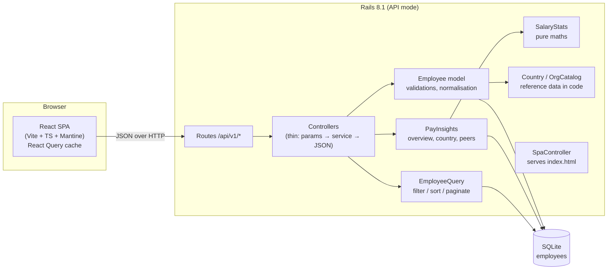

# Architecture

## Overview

In development Vite (:5173) proxies `/api` to Rails (:3000). In production a single Docker image
serves both: the React build is copied into Rails' `public/`, and any non-API path falls back to
`index.html` so client-side routes survive a refresh.

## Backend layout (`backend/`)

| Path | Responsibility |
|---|---|
| `app/models/employee.rb` | Validations, normalisation (email lower-case, name squish), search scope, derived currency |
| `app/models/user.rb` | Login account with a bcrypt password and a role (`hr_manager` or `viewer`); the one authorization rule |
| `app/controllers/concerns/authentication.rb` | Session sign-in/out, 30-minute idle expiry, role check |
| `app/models/country.rb` | Immutable `Data` value objects: code → name, currency |
| `app/models/org_catalog.rb` | Departments (closed list), suggested titles, employment types |
| `app/services/employee_query.rb` | Whitelisted filtering, sorting and pagination for the list endpoint |
| `app/services/salary_stats.rb` | Pure functions: summarize, percentile (Excel PERCENTILE.INC), percentile rank, histogram |
| `app/services/pay_insights.rb` | Org overview, country breakdown, peer comparison |
| `app/services/employee_seeder.rb` | Deterministic 10k generator using batched `insert_all` |
| `app/serializers/employee_serializer.rb` | The one place that defines the employee JSON contract |
| `app/controllers/api/base_controller.rb` | Uniform error JSON: 400 / 404 / 422 with field errors |
| `lib/middleware/security_headers.rb` | CSP and other security headers on every response; `no-store` on API responses |
| `config/initializers/rack_attack.rb` | Per-IP rate limits for reads and writes |

## API (`/api/v1`)

| Method & path | Purpose |
|---|---|
| `GET /session`, `POST /session`, `DELETE /session` | Current user and CSRF token; sign in; sign out |
| `GET /employees?q&country&department&job_title&sort&direction&page&per_page` | Paginated list, `{data, meta}` |
| `GET /employees/:id` | Employee + `peer_comparison` |
| `POST /employees`, `PATCH /employees/:id`, `DELETE /employees/:id` | CRUD, HR manager role only (403 otherwise); 422 returns `{errors: {field: [msg]}}` |
| `GET /meta` | Countries (with currency), departments, job titles, employment types |
| `GET /insights/overview` | Headcount + per-country stats |
| `GET /insights/countries/:code` | Country stats, histogram, by department, by job title |
| `GET /up` | Health check |

Everything under `/api/v1` except `GET /session` and `POST /session` returns 401 without a signed-in
session. Writes need the `X-CSRF-Token` header.

## Data model

`users`: `name`, `email` (unique), `password_digest`, `role`.

`employees`: `employee_code` (unique), `full_name`, `email` (unique), `job_title`,
`department`, `country_code`, `employment_type`, `salary` (integer, annual, local currency), `hire_date`.

Indexes support every access path the UI uses: `(country_code, job_title)` for peer lookups and title
filters, `(country_code, department)` for department filters, `salary` for sort, `full_name` for the
default sort, and unique `email` / `employee_code`.

## Frontend layout (`frontend/src/`)

| Path | Responsibility |
|---|---|
| `api/client.ts` | `fetch` wrapper, typed endpoints, `ApiError` carrying field errors |
| `api/hooks.ts` | React Query hooks; session, sign-in and sign-out; writes invalidate lists, details and insights |
| `lib/format.ts` | Currency formatting (Intl), compa-ratio wording, pay-position classification |
| `lib/employeeForm.ts` | Form values ↔ API payload, client validation mirroring the server |
| `lib/filters.ts` | List filters ↔ URL search params (shareable, refresh-safe views) |
| `components/` | `EmployeeForm`, `PeerComparisonCard`, `GroupStatsTable`, `StatCard`, `QueryState` |
| `pages/` | Login, Employees, Employee detail, Pay insights, Country insights (lazy-loaded with the chart lib) |
